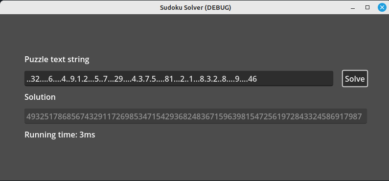

# Sudoku Solver

This is implemented in Godot 4.

The algorithm works by constraint propagation.

The constraint is that all rows, columns, and 3x3 boxes contain each digit from 1 to 9.

To optimize the speed, the next empty cell is tested that has the least number of possible values.

On each pass, each possible number is added to the empty cell and this number is removed from peer cells and then the next empty cell is tried.

If any empty cell ends up with no possible values then one of the previous entries was wrong so the recursive loop backpedals to this point and starts again with the next possible (candidate) number.

## Notes

 Regular arrays must be used since we pass the grid by reference.

 We avoid having to deeply duplicate the candidates by using strings of numbers.
 